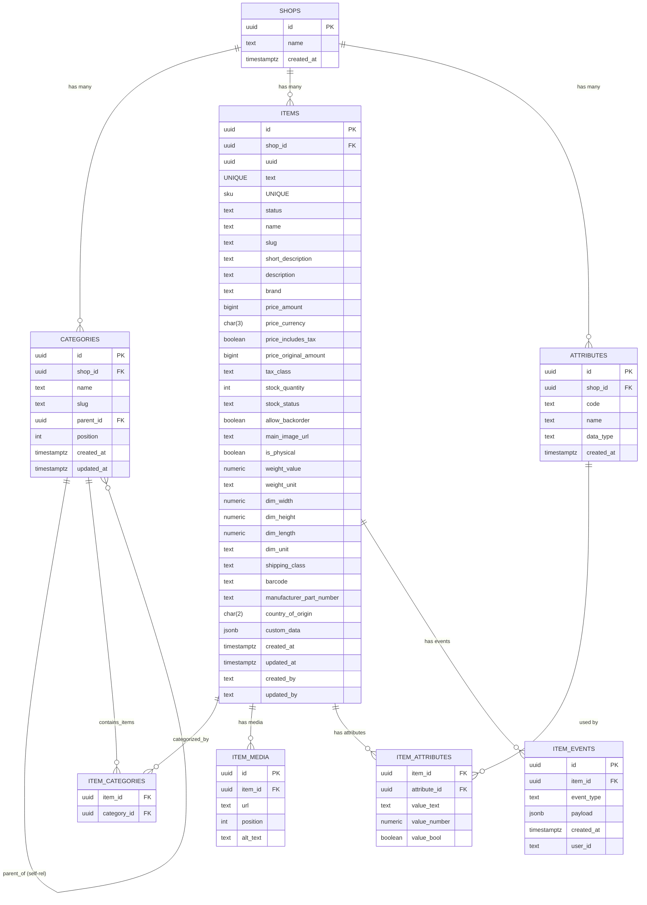

# Database Architecture

To improve indexation and performance I suggest the following layout. (See the Item description in [API Architecture](/API/Architecture) to have a better understanding of the data set we are thinking about).

**Diagram**
Sadly the wiki can not display it. Therefore please copy paste the mermaid section into any markdown convertor and have a look (I like Obsidian for that). Here is a picture of the diagram.





Table for Categories:
```sql
CREATE TABLE categories (
    id          UUID PRIMARY KEY DEFAULT gen_random_uuid(),
    shop_id     UUID NOT NULL REFERENCES shops(id) ON DELETE CASCADE,

    name        TEXT NOT NULL,
    slug        TEXT NOT NULL,
    parent_id   UUID REFERENCES categories(id),

    position    INT NOT NULL DEFAULT 0,    -- for sorting
    created_at  TIMESTAMPTZ NOT NULL DEFAULT now(),
    updated_at  TIMESTAMPTZ NOT NULL DEFAULT now()
);

CREATE UNIQUE INDEX ux_categories_shop_slug
    ON categories (shop_id, slug);
```

Table to store essential item data

```sql
CREATE TABLE items (
    id          UUID PRIMARY KEY DEFAULT gen_random_uuid(),
    shop_id     UUID NOT NULL REFERENCES shops(id) ON DELETE CASCADE,

    uuid        UUID NOT NULL UNIQUE,             -- external UUID if you want it separate
    sku         TEXT UNIQUE,                      -- can be NULL, but unique if present
    status      TEXT NOT NULL CHECK (status IN ('draft', 'active', 'archived')),

    name        TEXT NOT NULL,
    slug        TEXT NOT NULL,
    short_description TEXT,
    description TEXT,
    brand       TEXT,

    -- Price
    price_amount        BIGINT NOT NULL,         -- cents
    price_currency      CHAR(3) NOT NULL,        -- 'EUR', 'USD', ...
    price_includes_tax  BOOLEAN NOT NULL DEFAULT TRUE,
    price_original_amount BIGINT,                -- NULL if no discount
    tax_class           TEXT NOT NULL DEFAULT 'standard',

    -- Inventory
    stock_quantity      INT NOT NULL DEFAULT 0,
    stock_status        TEXT NOT NULL CHECK (stock_status IN ('in_stock', 'out_of_stock', 'preorder', 'backorder')),
    allow_backorder     BOOLEAN NOT NULL DEFAULT FALSE,

    -- Media
    main_image_url      TEXT,

    -- Shipping
    is_physical         BOOLEAN NOT NULL DEFAULT TRUE,
    weight_value        NUMERIC(12,4),
    weight_unit         TEXT,
    dim_width           NUMERIC(12,4),
    dim_height          NUMERIC(12,4),
    dim_length          NUMERIC(12,4),
    dim_unit            TEXT,
    shipping_class      TEXT,

    -- Identifiers
    barcode                 TEXT,
    manufacturer_part_number TEXT,
    country_of_origin       CHAR(2),             -- ISO country code, e.g. 'DE'

    -- Custom
    custom_data         JSONB,                   -- for plugins/free-form data

    -- System
    log_table_ref       UUID,                    -- references some other log table if you want
    created_at          TIMESTAMPTZ NOT NULL DEFAULT now(),
    updated_at          TIMESTAMPTZ NOT NULL DEFAULT now(),
    created_by          TEXT,                    -- keycloak user ID
    updated_by          TEXT
);

-- URL friendly & shop-scoped: one slug per shop
CREATE UNIQUE INDEX ux_items_shop_slug
    ON items (shop_id, slug);

-- Useful query indexes
CREATE INDEX ix_items_shop_status
    ON items (shop_id, status);

CREATE INDEX ix_items_shop_brand
    ON items (shop_id, brand);

CREATE INDEX ix_items_price
    ON items (shop_id, price_amount);

CREATE INDEX ix_items_stock_status
    ON items (shop_id, stock_status);

```


Model join relationship between the item and category table:


```sql
CREATE TABLE item_categories (
    item_id     UUID NOT NULL REFERENCES items(id) ON DELETE CASCADE,
    category_id UUID NOT NULL REFERENCES categories(id) ON DELETE CASCADE,
    PRIMARY KEY (item_id, category_id)
);

CREATE INDEX ix_item_categories_category
    ON item_categories (category_id);

```

Table for the Media Gallery:

```sql
CREATE TABLE item_media (
    id          UUID PRIMARY KEY DEFAULT gen_random_uuid(),
    item_id     UUID NOT NULL REFERENCES items(id) ON DELETE CASCADE,
    url         TEXT NOT NULL,
    position    INT NOT NULL DEFAULT 0,   -- 0,10,20,... for reordering
    alt_text    TEXT
);

CREATE INDEX ix_item_media_item
    ON item_media (item_id);
```

Attribute definition table
```sql
CREATE TABLE attributes (
    id          UUID PRIMARY KEY DEFAULT gen_random_uuid(),
    shop_id     UUID NOT NULL REFERENCES shops(id) ON DELETE CASCADE,

    code        TEXT NOT NULL,               -- e.g. 'color', 'material'
    name        TEXT NOT NULL,               -- display name
    data_type   TEXT NOT NULL CHECK (data_type IN ('text', 'number', 'boolean')),
    created_at  TIMESTAMPTZ NOT NULL DEFAULT now()
);

CREATE UNIQUE INDEX ux_attributes_shop_code
    ON attributes (shop_id, code);

```


Item_Attribute table:

```sql

CREATE TABLE item_attributes (
    item_id     UUID NOT NULL REFERENCES items(id) ON DELETE CASCADE,
    attribute_id UUID NOT NULL REFERENCES attributes(id) ON DELETE CASCADE,

    value_text  TEXT,
    value_number NUMERIC(20,4),
    value_bool  BOOLEAN,

    PRIMARY KEY (item_id, attribute_id)
);

CREATE INDEX ix_item_attributes_attr
    ON item_attributes (attribute_id);
```


For later the System log and event table:

```sql
CREATE TABLE item_events (
    id          UUID PRIMARY KEY DEFAULT gen_random_uuid(),
    item_id     UUID NOT NULL REFERENCES items(id) ON DELETE CASCADE,
    event_type  TEXT NOT NULL,          -- 'created', 'updated', 'price_changed', ...
    payload     JSONB,                  -- old/new values, diff, etc.
    created_at  TIMESTAMPTZ NOT NULL DEFAULT now(),
    user_id     TEXT                    -- Keycloak ID if available
);

CREATE INDEX ix_item_events_item
    ON item_events (item_id);

CREATE INDEX ix_item_events_type
    ON item_events (event_type);

```


