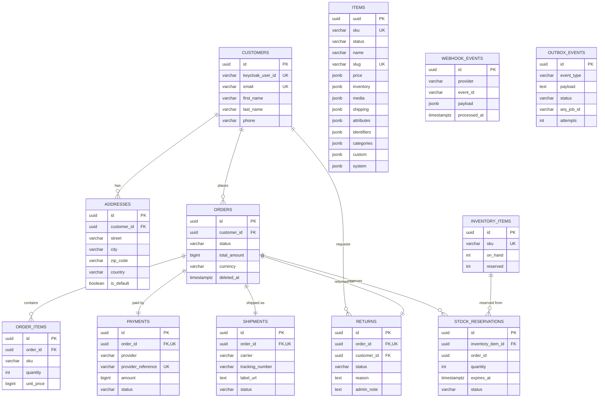

# Database Architecture

The store runs on **PostgreSQL 17**. This page documents the schema that is actually in
the database.

> **This page previously described a different schema.** It proposed `shops`,
> `categories`, `item_categories`, `item_media`, `attributes`, `item_attributes` and
> `item_events` — a fully normalised catalogue. None of those tables were ever built. What
> shipped keeps the item's nested detail in `JSONB` columns instead. The old design is
> discussed under [The road not taken](#the-road-not-taken) because the trade-off is worth
> understanding, but it is a proposal, not a description.

## The tables

Twelve tables, in four groups:


```mermaid
erDiagram
    CUSTOMERS ||--o{ ADDRESSES : "has"
    CUSTOMERS ||--o{ ORDERS : "places"
    CUSTOMERS ||--o{ RETURNS : "requests"

    ORDERS ||--o{ ORDER_ITEMS : "contains"
    ORDERS ||--|| PAYMENTS : "paid by"
    ORDERS ||--|| SHIPMENTS : "shipped as"
    ORDERS ||--|| RETURNS : "returned as"
    ORDERS ||--o{ STOCK_RESERVATIONS : "reserves"

    INVENTORY_ITEMS ||--o{ STOCK_RESERVATIONS : "reserved from"

    ITEMS {
        uuid uuid PK
        varchar sku UK
        varchar status
        varchar name
        varchar slug UK
        jsonb price
        jsonb inventory
        jsonb media
        jsonb shipping
        jsonb attributes
        jsonb identifiers
        jsonb categories
        jsonb custom
        jsonb system
    }

    CUSTOMERS {
        uuid id PK
        varchar keycloak_user_id UK
        varchar email UK
        varchar first_name
        varchar last_name
        varchar phone
    }

    ADDRESSES {
        uuid id PK
        uuid customer_id FK
        varchar street
        varchar city
        varchar zip_code
        varchar country
        boolean is_default
    }

    ORDERS {
        uuid id PK
        uuid customer_id FK
        varchar status
        bigint total_amount
        varchar currency
        timestamptz deleted_at
    }

    ORDER_ITEMS {
        uuid id PK
        uuid order_id FK
        varchar sku
        int quantity
        bigint unit_price
    }

    PAYMENTS {
        uuid id PK
        uuid order_id FK,UK
        varchar provider
        varchar provider_reference UK
        bigint amount
        varchar status
    }

    INVENTORY_ITEMS {
        uuid id PK
        varchar sku UK
        int on_hand
        int reserved
    }

    STOCK_RESERVATIONS {
        uuid id PK
        uuid inventory_item_id FK
        uuid order_id
        int quantity
        timestamptz expires_at
        varchar status
    }

    SHIPMENTS {
        uuid id PK
        uuid order_id FK,UK
        varchar carrier
        varchar tracking_number
        text label_url
        varchar status
    }

    RETURNS {
        uuid id PK
        uuid order_id FK,UK
        uuid customer_id FK
        varchar status
        text reason
        text admin_note
    }

    WEBHOOK_EVENTS {
        uuid id PK
        varchar provider
        varchar event_id
        jsonb payload
        timestamptz processed_at
    }

    OUTBOX_EVENTS {
        uuid id PK
        varchar event_type
        text payload
        varchar status
        varchar arq_job_id
        int attempts
    }
```

Every table carries `created_at` and `updated_at` (`timestamptz`, defaulting to `now()`).
`orders` additionally carries `deleted_at` — it is the one table that soft-deletes,
because a cancelled order is a business record you may not destroy.

## Catalogue

### `items`

The catalogue. Scalar, searchable fields are real columns; the nested blocks from the
[item shape](/API/Architecture#the-item-shape) are `JSONB`.

| Column | Type | Notes |
|---|---|---|
| `uuid` | `uuid` | Primary key |
| `sku` | `varchar(100)` | Unique |
| `slug` | `varchar(255)` | Unique — the URL-facing identifier |
| `status` | `varchar(20)` | `draft` / `active` / `archived`, indexed |
| `name` | `varchar(255)` | Indexed |
| `brand` | `varchar(100)` | Indexed |
| `short_description` | `varchar(500)` | |
| `description` | `text` | |
| `categories`, `price`, `media`, `inventory`, `shipping`, `attributes`, `identifiers`, `custom`, `system` | `jsonb` | Not null |

Indexed on `sku` (unique), `slug` (unique), `status`, `name` and `brand` — the fields you
filter and sort a shop listing by. Anything inside a `JSONB` column is not covered by
those indexes; a query filtering on `price->>'amount'` does a sequential scan unless you
add an expression index for it.

Note there is no `shop_id` anywhere. The schema is single-tenant: one deployment, one
shop. Multi-tenancy would be a schema change, not a configuration change.

## Customers

### `customers`

| Column | Type | Notes |
|---|---|---|
| `id` | `uuid` | Primary key |
| `keycloak_user_id` | `varchar(255)` | Unique — the `sub` claim from the token |
| `email` | `varchar(255)` | Unique |
| `first_name`, `last_name` | `varchar(100)` | Not null |
| `phone` | `varchar(32)` | Nullable |

`keycloak_user_id` is the join back to the identity provider. Keycloak owns credentials
and roles; this table owns everything commercial about the person. That split is why
wiping the Keycloak volume orphans customer rows — the profile survives, the login does
not.

### `addresses`

Belongs to a customer, cascade-deleted with them. `country` is a 2-character ISO code and
`is_default` marks the one used at checkout.

## Orders, payment and stock

### `orders`

| Column | Type | Notes |
|---|---|---|
| `status` | `varchar(25)` | Defaults to `draft`, indexed |
| `total_amount` | `bigint` | Minor units. `CHECK (total_amount >= 0)` |
| `currency` | `varchar(3)` | ISO 4217 |
| `deleted_at` | `timestamptz` | Soft delete |

Money is `bigint` in minor units everywhere in this schema — cents, never a float. See
[Orders and Fulfillment](/Orders-and-Fulfillment) for the status machine.

### `order_items`

A line on an order, cascade-deleted with it. Carries `unit_price` as a **snapshot**, not a
lookup — repricing an item must not silently rewrite what somebody already paid.
Constrained by `CHECK (quantity > 0)` and `CHECK (unit_price >= 0)`.

### `payments`

One payment per order, enforced by a unique constraint on `order_id`. `provider_reference`
(the Stripe payment intent id) is also unique, which is what makes webhook processing safe
to retry.

### `inventory_items` and `stock_reservations`

Authoritative stock, deliberately separate from the `inventory` block on an item.

`inventory_items` holds `on_hand` and `reserved` under three check constraints:

```sql
CHECK (on_hand >= 0)
CHECK (reserved >= 0)
CHECK (on_hand >= reserved)
```

That third one is the interesting one. It makes overselling a database error rather than a
race the application has to win — you cannot reserve stock that is not there, however the
code is written or however many requests arrive at once.

`stock_reservations` holds a claim on stock with an `expires_at`, indexed so the sweeper
can find lapsed ones cheaply. A reservation is taken at checkout and either committed on
payment or released on failure or expiry. `reservation_ttl_minutes` sets the window.

## Fulfillment and integration

### `shipments`

One shipment per order, enforced by a unique constraint on `order_id` — the same rule the
[roadmap](/Orders-and-Fulfillment) calls "one shipment label per order". `label_url` points
at the object store, not at bytes in the database.

### `returns`

One return per order, unique on `order_id`. `reason` comes from the customer, `admin_note`
from whoever decided. Both the order and the customer are `ON DELETE RESTRICT`: a return
is a financial record and must not vanish with its parent.

### `webhook_events`

Every inbound provider event, with a unique constraint on `(provider, event_id)`.

**That constraint is the idempotency mechanism.** Stripe will redeliver, and a duplicate
`payment_succeeded` must not mark an order paid twice or commit stock twice. The insert
fails on the second attempt, the handler returns `200`, nothing happens. `processed_at`
being null distinguishes a received event from a handled one.

### `outbox_events`

The transactional outbox. `event_type` and a serialised `payload`, plus `status`,
`arq_job_id` and an `attempts` counter, indexed on `(status, created_at)` for the poller's
sweep.

The point is that a state change and its follow-up job commit in **one transaction**. The
API never enqueues to Redis directly, so there is no window in which the database says
"paid" but the label job was lost because the process died. See
[the outbox](/Orders-and-Fulfillment#the-outbox).

`attempts` and `OUTBOX_MAX_ATTEMPTS` bound retries. Exhausting them sets `FAILED`, which
means *the event never reached the queue* — distinct from a job that ran and exhausted its
own retries, which is `DEAD`.

---

## The road not taken

The original proposal on this page normalised the catalogue: `categories` and
`item_categories` for a category tree, `item_media` for the gallery, `attributes` and
`item_attributes` for an EAV attribute model, `item_events` for an audit log, and a
`shops` table making the whole thing multi-tenant.

What shipped collapses those into `JSONB` columns on `items`. The trade:

**What the JSONB version buys.** One insert writes a whole product. Reading one is one row
with no joins. A plugin can attach arbitrary data under `custom` without a migration —
which is close to the point of the project, since the catalogue is meant to be extended by
people who are not touching the core.

**What it costs.** No referential integrity on categories: they are strings in an array,
so nothing stops a typo creating a category of one. No efficient faceted search — filtering
across attribute values means either expression indexes per attribute or a sequential scan.
No audit trail; `item_events` does not exist, and `updated_at` is all you get.

For a single-tenant shop with a catalogue that fits comfortably in memory, that is a
reasonable trade. It stops being reasonable when you want faceted search across a large
catalogue, or category management that cannot be broken by a typo. If OpenTaberna grows
into either, `categories` and `item_attributes` are the first two tables to build, and the
proposal above is a decent starting point for them.
