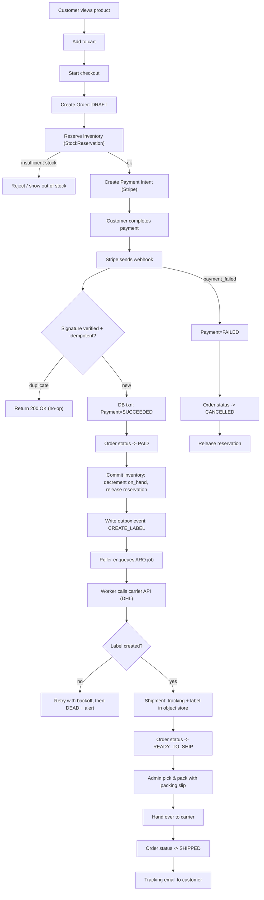

# Orders and Fulfillment

This is the path a purchase takes through the system, and — more usefully — what happens
when a step of it fails.

## The flow



## Order status

| Status | Meaning |
|---|---|
| `draft` | A cart. Nothing is reserved, nothing is owed. |
| `pending_payment` | Checkout started. Stock is reserved, payment intent exists. |
| `paid` | Payment confirmed by webhook. Stock committed. |
| `ready_to_ship` | A shipment exists, label included where the carrier is automated. |
| `shipped` | Handed to the carrier. |
| `cancelled` | Payment failed, timed out, or the customer cancelled a draft. |
| `refunded` | Money returned, via `charge.refunded`. |

Transitions are enforced by the application layer, not merely suggested:

```
draft            → pending_payment    (checkout starts)
draft            → cancelled          (customer cancels)
pending_payment  → paid               (webhook: payment_succeeded)
pending_payment  → cancelled          (webhook: payment_failed, or timeout)
paid             → ready_to_ship      (shipment created)
ready_to_ship    → shipped            (handed to carrier)
paid | shipped   → refunded           (webhook: charge.refunded)
```

Related states, each on its own record:

| Record | States |
|---|---|
| Payment | `pending` → `succeeded` \| `failed` \| `refunded` |
| Shipment | `pending` → `label_created` → `handed_over` |
| Return | `requested` → `approved` \| `rejected`; `approved` → `completed` |

## Checkout reserves, it does not deduct

`POST /v1/orders/{order_id}/checkout` takes a **reservation** against `inventory_items`,
not a deduction. The row's `reserved` count goes up; `on_hand` does not move until payment
actually succeeds.

This matters because the alternative — deducting at checkout — loses stock every time
somebody abandons a payment page. Instead the reservation carries an `expires_at`
(`RESERVATION_TTL_MINUTES`, default 15) and a sweeper job releases lapsed ones.

Overselling is prevented by the database rather than by application care:

```sql
CHECK (on_hand >= reserved)
```

Two simultaneous checkouts for the last unit cannot both succeed, regardless of how the
requests interleave. One gets a constraint violation and is rejected.

## Payment is confirmed by webhook, never by the browser

The API creates a Stripe payment intent, and the customer completes payment against
Stripe. **The API does not treat the browser coming back as proof of payment.** A client
can lie, close the tab, or lose its connection at exactly the wrong moment.

The authority is `POST /v1/webhooks/stripe`, which:

1. **Verifies the Stripe signature.** Unsigned or mis-signed events are rejected.
2. **Deduplicates** on `(provider, event_id)`, which is a unique constraint in
   `webhook_events`. Stripe redelivers on any non-2xx, and at-least-once delivery means
   duplicates are normal traffic, not an error case. A repeat is a no-op returning `200`.
3. **Commits atomically**: payment status, order status and the inventory commit land in
   one transaction. There is no state where the order is paid but the stock was never
   taken.

### Local webhooks

The development stack runs a Stripe CLI listener container that forwards test events to
the API and writes its generated signing secret to a volume the API reads. You never copy
a `whsec_...` by hand, and `STRIPE_WEBHOOK_SECRET` only needs setting when running the API
outside Compose or against a Dashboard-managed endpoint.

## The outbox

Once an order is paid, a carrier label needs creating — slow, failure-prone, and
absolutely not something to do inside the webhook request.

The naive approach is to enqueue a job to Redis after committing the transaction. That has
a hole: if the process dies between the commit and the enqueue, the order is paid forever
and no label is ever made. Nothing retries, because nothing knows.

So the API never enqueues directly. It writes a row to `outbox_events` **in the same
transaction as the state change**. Either both land or neither does. A poller in the
worker sweeps `PENDING` rows every `OUTBOX_POLL_INTERVAL` seconds (default 30) and hands
them to ARQ.

The cost is latency — a job may wait up to one poll interval. The benefit is that a job
cannot be lost, only delayed.

### Two ways to fail, and they mean different things

| Status | Meaning |
|---|---|
| `FAILED` | The poller could not hand the event to Redis within `OUTBOX_MAX_ATTEMPTS` sweeps. **The job never ran.** |
| `DEAD` | The job was enqueued and ran, but exhausted `ARQ_MAX_TRIES` attempts. **The job ran and gave up.** |

Worth keeping straight when something is stuck: `FAILED` points at Redis or the poller,
`DEAD` points at the job itself — usually the carrier API.

ARQ retries with exponential backoff (2^attempt seconds) up to `ARQ_MAX_TRIES` (default
5). Exhausting them triggers the dead-letter hook, which logs at `ERROR` and marks the row
`DEAD` so it is visible in the database for investigation rather than only in a log.

### Background jobs

| Job | Trigger | Does |
|---|---|---|
| `create_label` | Outbox, on payment | Calls the carrier, stores the label, records tracking |
| `expire_reservations_sweep` | Scheduled | Releases reservations past `expires_at` |
| `poll_outbox` | Every `OUTBOX_POLL_INTERVAL`s | Enqueues pending outbox events |

## Carriers

Label creation goes through a `CarrierAdapter` interface, with two implementations:

- **DHL** — the Parcel DE REST API. Needs `DHL_CLIENT_ID`, `DHL_CLIENT_SECRET` and
  `DHL_BILLING_NUMBER`. Defaults to the sandbox base URL; returns PDF or ZPL.
- **Manual** — no carrier call. The admin enters a tracking number by hand via
  `POST /v1/admin/orders/{order_id}/ship`.

Manual is not a stub. Shipping by hand is a legitimate way to run a small shop, and it is
the path that works before any carrier account exists.

Label files live in MinIO (`STORAGE_BUCKET_LABELS`); the database stores a URL.

## What the back office does

| Endpoint | Use |
|---|---|
| `GET /v1/admin/orders/` | Work queue, filtered by status |
| `GET /v1/admin/orders/pick-list` | Batch pick list across orders |
| `GET /v1/admin/orders/{id}/packing-slip` | Packing slip for one order |
| `POST /v1/admin/orders/{id}/shipments` | Create the shipment record |
| `POST /v1/admin/orders/{id}/label` | Queue a carrier label job |
| `GET /v1/admin/orders/{id}/label` | Download the label |
| `POST /v1/admin/orders/{id}/ship` | Mark shipped, with manual tracking |
| `PATCH /v1/admin/orders/{id}/status` | Override status |

The status override is an escape hatch for when reality and the state machine disagree —
a parcel handed over without a scan, a payment settled out of band. It bypasses the
transition rules, so it is admin-only and worth logging when used.

## Returns

A customer opens a return with `POST /v1/orders/{order_id}/returns`, giving a reason. One
return per order, enforced by a unique constraint.

An admin then resolves it with `PATCH /v1/admin/returns/{return_id}`: `approved`,
`rejected`, or `completed` once the goods are physically back. Refunds arrive separately
as a `charge.refunded` webhook, which moves the order to `refunded`.

Returns are `ON DELETE RESTRICT` against both the order and the customer — a financial
record must not disappear because a parent row was removed.

## Reading the trail

Every request gets a correlation ID from the middleware, threaded through the logs and
returned as `request_id` in the response envelope. It follows work across the API and the
worker, so "my order never shipped" can be traced from the webhook through the outbox row
to the job and the carrier call.

When an order is stuck, the useful order of checks is:

1. `orders.status` — where did it stop?
2. `payments.status` — did money actually arrive?
3. `webhook_events` — did Stripe's event arrive, and is `processed_at` set?
4. `outbox_events.status` — `PENDING` (waiting), `FAILED` (never queued) or `DEAD` (ran
   and gave up)?
5. Worker logs for the correlation ID.
