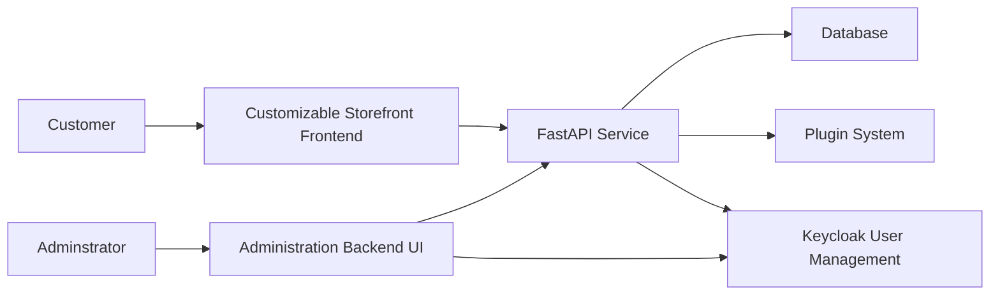
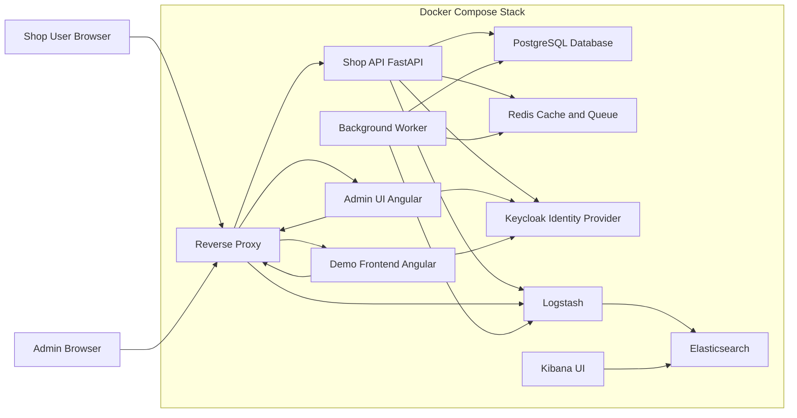

# Open Taberna

Welcome to the OpenTaberna Wiki. Here you can find hopfully helpful information on the OpenTaberna Project. 
We are a OpenSource Project, so feel free to use this software as ever you like. 

The Project exists because I think most Shop Systems today are expensive, slow, require too much manual labor or are just not usable. 
While I can not do anything about the UI, I can provide the Tools and Backbone for a solid Self Hosted Webshop. 

The Goal is to provide the nesseccary Skeleton so that you can build your own UI in whatever way you prefer. Maybe in PHP or Angular or if you are really crazy in C. No opinion here. 

## Architecture

OpenTaberna is split in 6 different Software Parts. The first two are easy:
- MySQL for Data storage and Management
- Keycloak for User administration

Now to the core of the Project:
The FastAPI. I choose FastAPI for two very good reasons:
1. It is very easy for you to build on a FastAPI interface that has it own living documentation in /docs that will always be up to date.
2. Personally I do not know enough to try programming this in other languages.

The API is the logic handler. Either providing endpoints for your Shop Frontend or the Administration Backend UI and handling Data coming or going into the Database. It is the abstract interface setting how to store or provide data. Having set interfaces is the most valueable thing when it comes to inter process communication and is the reason why this is the perfect project architecture.

The Administration UI is written in Angular. No real reason why I choose Angular over other languages. I honestly don't care about it too much. It appeard like something that gets the Job done.

---

# Setup Infrastructure

