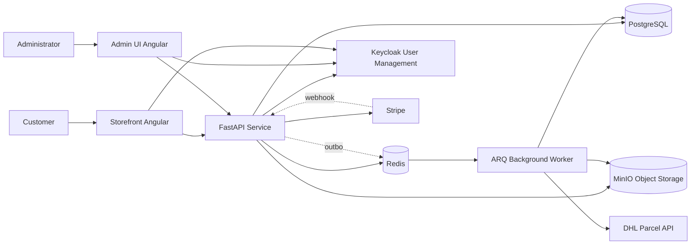
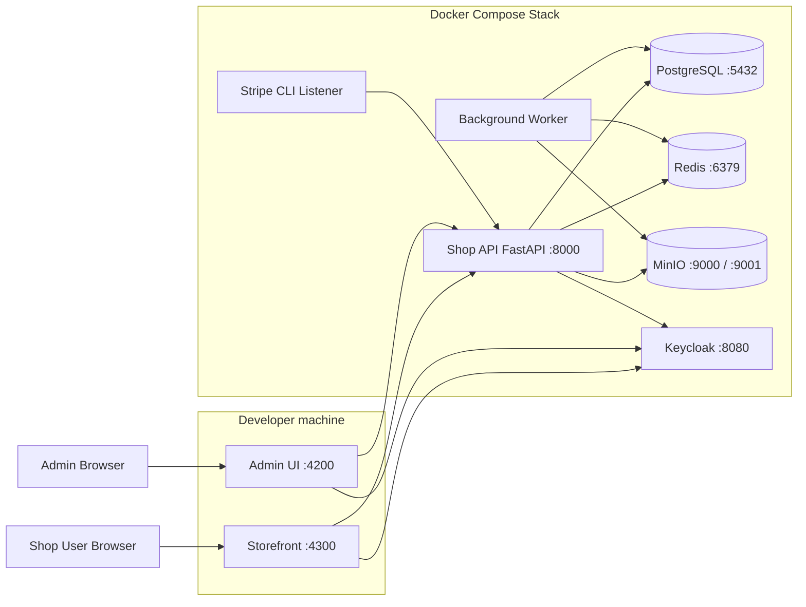

# Open Taberna

Welcome to the OpenTaberna Wiki. Here you can find hopefully helpful information on the
OpenTaberna Project. We are an OpenSource Project, so feel free to use this software as
ever you like.

The Project exists because I think most Shop Systems today are expensive, slow, require
too much manual labor or are just not usable. While I can not do anything about the UI, I
can provide the Tools and Backbone for a solid Self Hosted Webshop.

The Goal is to provide the necessary Skeleton so that you can build your own UI in
whatever way you prefer. Maybe in PHP or Angular or if you are really crazy in C. No
opinion here.

## The repositories

The project is split across four repositories rather than one:

| Repository | What it holds |
|---|---|
| [`OpenTaberna/fastapi`](https://github.com/OpenTaberna/fastapi) | The API, the background worker, the Keycloak realm and the development stack |
| [`OpenTaberna/frontend`](https://github.com/OpenTaberna/frontend) | The customer-facing storefront (Angular 22) |
| [`OpenTaberna/admin_frontend`](https://github.com/OpenTaberna/admin_frontend) | The back-office administration UI (Angular 22) |
| [`OpenTaberna/wiki`](https://github.com/OpenTaberna/wiki) | This wiki |

The development stack lives in the `fastapi` repository — it starts the database, cache,
identity provider, object storage and the API itself. Both frontends are started
separately and talk to it. See [Getting Started](/Getting-Started).

## Architecture

```mermaid
graph LR

    Shopper[Customer]
    Admin[Administrator]

    Frontend[Storefront Angular]
    AdminUI[Admin UI Angular]

    FastAPI[FastAPI Service]
    Worker[ARQ Background Worker]
    DB[(PostgreSQL)]
    Redis[(Redis)]
    Storage[(MinIO Object Storage)]
    Keycloak[Keycloak User Management]
    Stripe[Stripe]
    DHL[DHL Parcel API]

    Shopper --> Frontend
    Admin --> AdminUI

    Frontend --> FastAPI
    AdminUI --> FastAPI

    FastAPI --> DB
    FastAPI --> Redis
    FastAPI --> Storage
    FastAPI --> Keycloak
    AdminUI --> Keycloak
    Frontend --> Keycloak

    FastAPI --> Stripe
    Stripe -.webhook.-> FastAPI

    FastAPI -.outbox.-> Redis
    Redis --> Worker
    Worker --> DB
    Worker --> Storage
    Worker --> DHL
```

OpenTaberna is built from these parts:

- **PostgreSQL 17** for data storage. (Earlier drafts of this page said MySQL — the
  project runs PostgreSQL, and the schema uses `JSONB` columns heavily.)
- **Keycloak 26** for user administration. The realm is checked into the `fastapi`
  repository and imported on container start, so the whole auth setup is reproducible
  from a clean checkout. See [Authorization](/Authorization).
- **Redis 8** as a cache and as the queue the background worker pulls from.
- **MinIO** (S3-compatible) for product images and carrier label files.

Now to the core of the Project:

**The FastAPI.** I chose FastAPI for two very good reasons:

1. It is very easy for you to build on a FastAPI interface that has its own living
   documentation in `/docs` that will always be up to date.
2. Personally I do not know enough to try programming this in other languages.

The API is the logic handler. It provides endpoints for the Shop Frontend and the
Administration Backend UI, and handles data coming into or going out of the database. It
is the abstract interface setting how to store or provide data. Having set interfaces is
the most valuable thing when it comes to inter-process communication and is the reason
why this is the perfect project architecture.

**The background worker** runs the jobs that must not block a web request — creating
carrier labels, sending tracking mail. Work reaches it through a
[transactional outbox](/Orders-and-Fulfillment#the-outbox), so a job is never lost
because the process died between committing a database change and enqueuing the job.

**The Administration UI** is written in Angular. No real reason why I chose Angular over
other languages. I honestly don't care about it too much. It appeared like something that
gets the job done.

**The Storefront** is also Angular, and is deliberately the most replaceable part of the
system. It is one possible shop UI, not *the* shop UI — that is the point of the project.

## What the API can do today

| Service | What it covers |
|---|---|
| Item store | The product catalogue, including product images |
| Customers | Customer profiles and their addresses |
| Orders | Cart-to-order, checkout, cancellation |
| Payments | Stripe payment intents, confirmed by webhook |
| Inventory | Stock levels and reservations |
| Fulfillment | Carrier labels, packing slips, the job queue and outbox |
| Shipments | Tracking numbers and label files |
| Returns | Customer return requests and admin decisions |
| Health | Liveness and readiness probes |

The full endpoint list is on the [API Architecture](/API/Architecture) page, and a live,
always-current version is served by any running instance at `/docs`.

---

# Setup Infrastructure

This is what `docker-compose.dev.yml` in the `fastapi` repository actually starts:

```mermaid
graph LR

User[Shop User Browser]
AdminUser[Admin Browser]

subgraph Host[Developer machine]
  DemoUI[Storefront :4300]
  AdminUI[Admin UI :4200]
end

subgraph DockerHost[Docker Compose Stack]
  API[Shop API FastAPI :8000]
  Worker[Background Worker]
  StripeCLI[Stripe CLI Listener]

  DB[(PostgreSQL :5432)]
  Redis[(Redis :6379)]
  Minio[(MinIO :9000 / :9001)]
  Keycloak[Keycloak :8080]
end

User --> DemoUI
AdminUser --> AdminUI

DemoUI --> API
AdminUI --> API

DemoUI --> Keycloak
AdminUI --> Keycloak

API --> DB
API --> Redis
API --> Minio
API --> Keycloak

Worker --> DB
Worker --> Redis
Worker --> Minio

StripeCLI --> API
```

There is no reverse proxy and no Elasticsearch/Logstash/Kibana in the development stack —
an earlier version of this page drew both, and neither was ever built. The storefront
container ships an Nginx that serves the built app and proxies `/api` to the API, but that
is internal to that one container, not a stack-wide gateway.

For production topology, including where a reverse proxy *does* belong, see
[Deployment](/Deployment).
